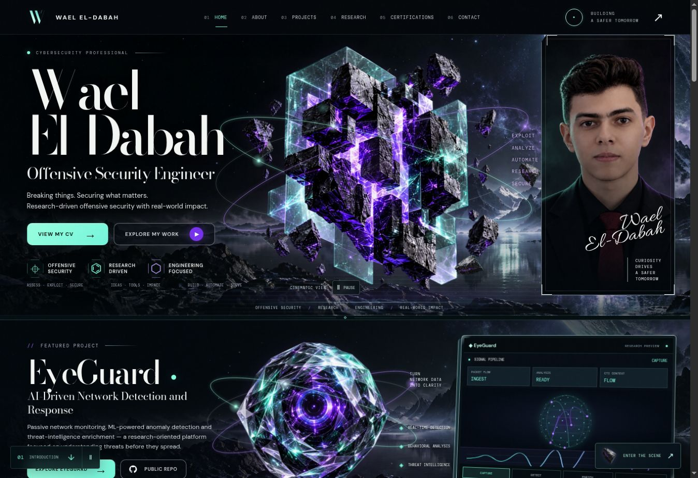
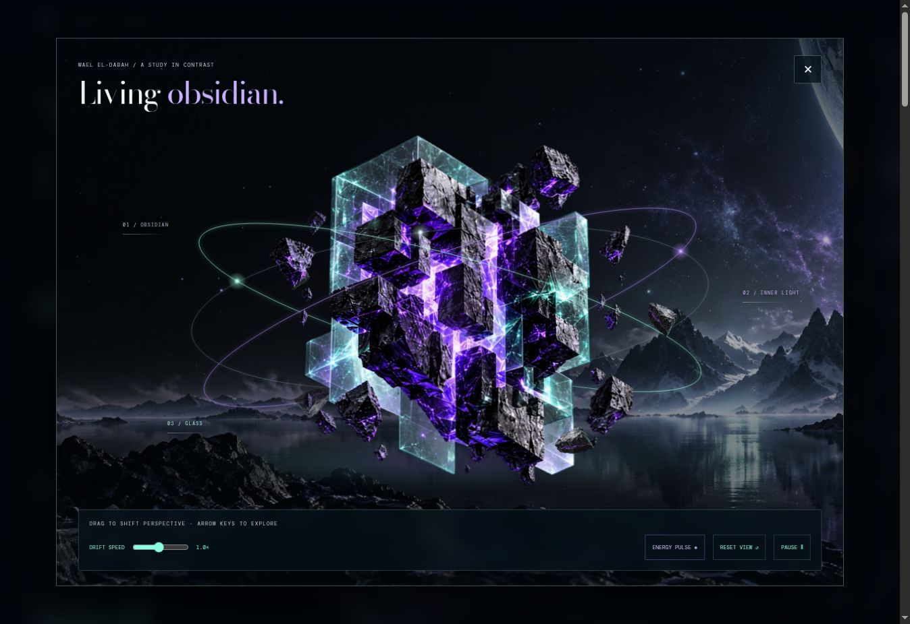

# Browser verification — Living Obsidian 7.0

Checked 2026-10-09 in cloud Chrome. V7 replaces the wireframe dimension study with an immersive version of the solid obsidian sculpture, independent textured fragments, a breathing light pass, perspective controls and a filled W monogram.

## Live deployment

GitHub Pages deployment of `bba816728dcd8e92a72cd5c7ff5e9f77ea763204` completed successfully. The root URL was refreshed and reported build `living-obsidian-v7.0`, no missing images and matching viewport/content width at 1348 pixels. The new scene launcher opened the solid sculpture dialog on the published site, with no site-origin warning/error logs.

## Observed in the V7 preview

- Visually inspected introduction, EyeGuard, credentials, approach, research, experience, CV and contact on desktop.
- At 360, 390, 768, 1280 and 1348 CSS pixels: content width matched viewport width, with no failed images after loading.
- The immersive sculpture remained visible at 360 and 390 pixels; all controls stayed inside the dialog.
- Dragging and arrow keys changed the compatibility artwork's perspective. Drift speed changed from 1.0× to 1.1×. Reset restored the default orientation and speed.
- Pause stopped the artwork transform between observations; Play resumed. The energy pulse control was available while playing and disabled while paused.
- Close and Escape returned focus to the scene launcher. Closing restored both a previously playing site and a previously paused site.
- Mobile navigation opened, followed the certifications anchor, and closed.
- Official INE eJPT and Huawei graphics loaded. Desktop eJPT and mobile Huawei detail dialogs opened and closed.
- Selecting Detect synchronized both EyeGuard tab groups, metrics and research copy.
- CV previews showed actual PDF first pages. The original three PDF paths remain unchanged from V6.1.
- No site-origin warning/error logs observed; extension metadata errors were excluded.
- Production build, JavaScript syntax, unique IDs, local assets/anchors and git whitespace checks passed.

## Rendering limits

WebGL is disabled in this cloud browser. Browser screenshots and interactions show the animated Canvas2D layered-art compatibility renderer. The sculpture artwork is textured raster art in this mode; it changes perspective, while orbital lights, dust and solid textured fragments animate independently. It is not the actual PBR WebGL mesh.

The WebGL renderer uses real stone geometry and transmissive glass, but its GPU output and sustained device performance have not been visually verified here. Responsive checks use a sized iframe, not physical iOS/Android devices. No pixel-identical reference match, 60 fps guarantee or Lighthouse score is claimed.

[Previous V6.1 verification](v6.1.md)
