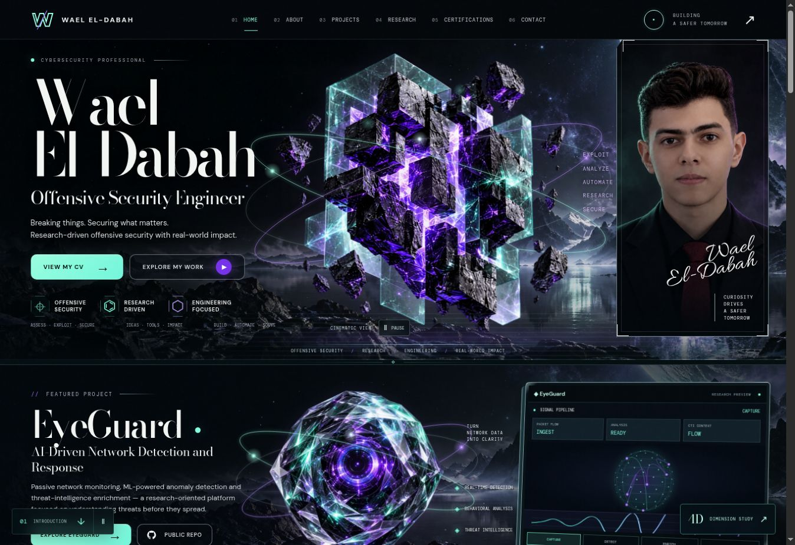

# Browser verification — Living Obsidian 6.1

Checked 2026-10-09 in the available cloud Chrome browser.

GitHub Pages deployment for `c1d739e0f249565c943f1ac4f001552b360057ee` completed successfully. The root URL was reopened and showed build `living-obsidian-v6.1`, loaded images and no horizontal overflow. The credential reveal correction was also checked on the live site.

## Observed

- Desktop sections were inspected: introduction, EyeGuard, credentials, approach, research, experience, CV and contact.
- Responsive checks at 360, 390, 768 and 1348 CSS pixels: no horizontal page overflow; no failed images after loading.
- Mobile navigation opened, followed the requested anchor and closed.
- EyeGuard stage selection updated both tab groups, metrics and explanatory copy.
- eJPT and Huawei detail dialogs opened; closing restored focus and the prior motion state.
- The industry PDF opened and rendered in Chrome. All three CV links and thumbnails resolve to retained local files.
- 4D projection rendered on mobile; its pause control changed state; closing restored focus to the launcher.
- Global motion control synchronizes with the hero control. Layered artwork transforms change when playing and stop when paused.
- No site-origin JavaScript errors observed. Chrome extension metadata errors are outside the site.
- Production build, JavaScript syntax, unique IDs, local asset/anchor audit and git whitespace checks passed.

## Follow-up required on hardware

WebGL is unavailable in this cloud browser. Screenshots and interaction checks show the animated layered-art compatibility renderer, not the PBR WebGL renderer. Actual GPU output, sustained frame rate, physical iOS/Android behavior and reduced-motion OS settings are not benchmarked here. The rendering caps in the source are targets, not measured guarantees. No Lighthouse score is claimed.

The responsive harness in viewport.html uses a sized iframe; it checks responsive layout, not real-device touch or GPU behavior.
